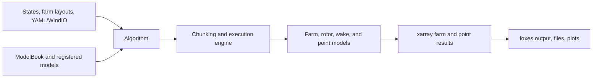

# FOXES Architecture

## Purpose

This document is the durable technical map of FOXES (Farm Optimization and
eXtended yield Evaluation Software). FOXES is a public Python library for
vectorized wind-farm simulation, engineering wake modelling, optimization
support, model comparison, and result evaluation. It is an established package,
not an application scaffold.

Use [naming conventions](naming-conventions.md) for detailed domain vocabulary,
types, dimensions, and identifiers. Use
[docstring conventions](docstrings.md) for public Python documentation and
[development](development.md) for setup, quality gates, test selection,
documentation builds, and navigation. Record the reason for a consequential
change in an [ADR](adr/README.md).

## Authoritative Sources

When sources disagree, use this order:

1. `AGENTS.md` and any applicable scoped repository instructions
2. Accepted ADRs in `docs/adr/`, for decisions within those policies
3. This architecture document and `docs/naming-conventions.md`
4. Public contracts and configuration in `foxes/` and `pyproject.toml`
5. Tests that exercise the contract
6. Examples, notebooks, and external references

Code and tests establish current runtime behavior and can expose documentation
drift, but they do not silently replace a documented durable decision. Resolve
the conflict and update the record in the same change.

## System Context

FOXES serves wind-energy researchers, engineers, and developers. A typical
caller supplies ambient conditions (`States`), a `WindFarm`, and model choices;
an `Algorithm` coordinates model execution through an `Engine`; the public
result is an xarray `Dataset` for evaluation, plotting, or export.

- Runtime: Python 3.10 through 3.14 on operating-system-independent Python
	environments.
- Core scientific stack: NumPy, pandas, SciPy, xarray, matplotlib, NetCDF4,
	h5netcdf/h5py, PyYAML, tqdm, and utm.
- Optional integrations are isolated behind extras, including `foxes-opt`,
	ERA5/metpy, geospatial shapefiles, MPI, Ray, multiprocess, and Dask.
- FOXES is an in-process library and command-line toolkit. It has no application
	server, authentication boundary, database, or browser frontend.
- Parallel execution can be local or distributed. Engine implementations own
	chunking, dispatch, and result collection; scientific models should remain
	backend-independent.

## Primary Execution Flow

1. Construct `States`, usually from `foxes.input.states`.
2. Construct a `WindFarm` and add turbines through layout helpers or directly.
3. Optionally customize a `ModelBook`; otherwise use its registered defaults.
4. Construct `Downwind`, `Iterative`, or `Sequential` with the farm, states, and
	model selections.
5. Call `calc_farm()` and optionally `calc_points()`.
6. Evaluate, plot, or write the resulting xarray datasets through
	`foxes.output` or downstream scientific code.

YAML parameter files mirror this object graph. The YAML reader constructs the
states, model book, farm, engine, and algorithm, then invokes the same runtime
contracts as Python callers.

## Module Boundaries

| Module | Owns | Main interfaces and dependencies |
|---|---|---|
| `foxes.config` | Global numeric types, work/input/output paths, NetCDF engine, UTM settings | `config`, `get_path`; standard library and NumPy-facing settings |
| `foxes.core` | Abstract model, algorithm, engine, state, farm, turbine, and data-container contracts | `Model`, `DataCalcModel`, `Algorithm`, `Engine`, `States`, `WindFarm`, `MData`, `FData`, `TData` |
| `foxes.models` | Concrete farm, rotor, turbine, wake, ground, and point models | `ModelBook`, concrete implementations; depends on core contracts and utilities |
| `foxes.algorithms` | Simulation orchestration and model-chain assembly | `Downwind`, `Iterative`, `Sequential`; depends on core contracts and registered models |
| `foxes.engines` | Serial, process, thread, Dask, MPI, Ray, and related execution backends | `Engine` implementations and runners; optional backend dependencies stay here |
| `foxes.input` | States, farm-layout readers, YAML/WindIO loading, and data-conversion CLIs | Produces core `States`, `WindFarm`, and algorithm inputs |
| `foxes.output` | Result evaluation, writing, plotting, animation, and sequential plugins | Consumes xarray calculation results; must not own simulation state |
| `foxes.data` | Discovery and registration of packaged static farm, state, curve, and model data | `StaticData`, `DataBook` entries; package resources and filesystem inputs |
| `foxes.utils` | Shared factories, dictionaries, geometry, interpolation, subclass lookup, and data access | Infrastructure used across modules; avoid domain orchestration here |
| `examples` and `notebooks` | Executable user workflows and documentation examples | Public APIs only wherever practical |
| `tests` | Consistency, verification, model, example, and utility coverage | May inspect internals only when the internal contract itself is under test |

The package root exposes a deliberately small convenience API, including
`WindFarm`, `Turbine`, `Engine`, `ModelBook`, configuration, static data, and the
main subpackages. Subpackage `__init__.py` files own curated exports. Internal
helpers do not become public merely because another module imports them.

## Runtime Contracts

### Dimensions And Variables

`foxes.constants` is the source of structural keys and dimension names; import
it as `FC`. `foxes.variables` is the source of physical field names; import it
as `FV`. Avoid local string copies of established constants.

- Farm data starts with dimensions `(FC.STATE, FC.TURBINE)`.
- Target variables start with `(FC.STATE, FC.TARGET, FC.TPOINT)`.
- Target coordinates use
	`(FC.STATE, FC.TARGET, FC.TPOINT, FC.XYH)`.
- Turbine ground positions have shape `(2,)` for static layouts or
	`(FC.STATE, 2)` for state-dependent layouts. `InitFarmData` materializes both
	as `FV.TXYH` with dimensions `(FC.STATE, FC.TURBINE, FC.XYH)`; spatial bounds
	contain every turbine position over all states.
- Ambient fields use the established `FV.AMB_*` names; do not infer ambientness
	from array location alone.
- Dimension metadata is part of the contract. A numerically correct array with
	the wrong dimension tuple is invalid.

### Data Containers

- `MData` stores model and chunk metadata.
- `FData` stores farm data and enforces leading state/turbine dimensions.
- `TData` stores targets, target-point weights, and point variables.
- These containers are NumPy-backed mappings with dimension and size metadata;
	they are not xarray datasets.
- Static `FC.TARGETS` coordinates retain dimensions
	`(FC.STATE, FC.TARGET, FC.TPOINT, FC.XYH)` with a singleton `FC.STATE` axis.
	Engine runners broadcast that axis to the active state chunk immediately
	before model calculation; state-dependent targets retain their full state
	axis.
- `LoadedData` separates `coords`, dimensioned `data_vars`, and non-array
	`extra_data` during initialization.
- The public boundary of `Algorithm.calc_farm()` and `calc_points()` is xarray.
	Convert at that boundary rather than making every chunk-local model xarray
	aware.
- Point calculations use target dimensions internally. `calc_points()` selects
	the single target-point axis and renames `FC.TARGET` to the public `FC.POINT`
	dimension before returning its dataset.

### Model Lifecycle

`Model.initialize()` recursively initializes submodels and calls `load_data()`.
Execution is bracketed by `set_running()` and `unset_running()`, which may move
large data through a stash. `finalize()` recursively releases initialized state
and cannot run while the model is marked running.

Do not manually set lifecycle flags, calculate with an uninitialized model, or
hide large persistent arrays outside the loading/stashing contract. A
`DataCalcModel.calculate()` implementation operates on one engine chunk and
returns a mapping of FOXES variable names to NumPy arrays with declared shapes.

### Algorithms And Engines

Algorithms own assembly and ordering of model chains. They prepare data,
delegate chunk execution to an engine, and reconstruct ordered xarray results.
Models must not select a parallel backend or depend on a concrete engine.

Use `Engine` as a context manager for an explicit backend. `Engine.new()` maps
established names to implementations. If no engine is active, FOXES creates a
default engine; `DefaultEngine` chooses a single-chunk or process strategy from
the problem size. Engine changes therefore require both numerical-equivalence
tests and coverage of chunk boundaries and cleanup.

Chunk result managers assert completeness after normal execution. During
exception unwinding they preserve the active worker or model exception instead
of replacing it with a secondary incomplete-chunk assertion.

## Extension Points

### Models And Registries

`ModelBook` owns named `FDict` collections for point models, rotor models,
turbine types and models, farm models and controllers, partial-wake models, wake
frames and deflections, wake superpositions and models, induction models, and
ground models.

Model-book factories parse parameterized names such as rotor-grid variants and
cache the resulting model. There is no universal `Model.new()` constructor;
only families that implement subclass discovery support `new()`. Preserve that
distinction between a Python class name, a registered model-book key, and a
parameterized factory name.

When adding a reusable model:

1. Implement the narrowest suitable core base class and its declared output and
	input-variable contracts.
2. Participate correctly in initialization, running-state, and finalization
	when the model owns data or submodels.
3. Export the public class from the owning package using the established
	explicit re-export style.
4. Register a default instance or factory in `ModelBook` only when name-based
	selection is part of the public feature.
5. Add focused model tests, integration coverage through an algorithm where
	appropriate, API documentation, and an executable example for user-facing
	behavior.

### States, Input, And Static Data

States implementations normalize ambient conditions for algorithms. Input
adapters own parsing and boundary validation; core models should not parse file
formats. `DataBook` and `StaticData` locate packaged or user-supplied data by
logical category. Keep resource lookup separate from scientific calculation.

The WindIO adapter selects the iterative algorithm and per-wake `ground_mirror`
for every enabled blockage (induction wake) model. It also enables ground
mirroring for TurbOPark wind deficits, preserving other per-wake ground settings.

State support-point diagnostics are opt-in loading-time outputs. Regular,
scattered, Weibull, binned, and turbine-backed spatial states expose
`grid_point_plot`; NEWA and meso/micro states use their existing WRF and support
plot hooks. Point-cloud variants share the rendering helper in
`foxes/input/states/point_cloud_data.py`, including cleanup after failed writes.
Separate `*_point_plot_farm_pars` dictionaries customize the farm overlay without
changing support/reference markers or normal visible-turbine/title defaults.
Turbine-backed diagnostics show the current farm layout, not later
state-dependent or optimization coordinates. These plots do not select an
engine or configure global matplotlib state.
Regular CFD and meso/micro support diagnostics support opt-in per-axis plot
strides, owned by shared point-plot helpers. They preserve grid edges and leave
loaded state data and reference points unchanged. `FarmLayoutOutput` accepts a
figure-only boundary override through `bargs`, so diagnostics from temporary
loading farms can show the original geometry without changing numerical farm
bounds or loading behavior.

### Sequential Plugins

Sequential extensions implement the plugin lifecycle (`initialize`, `update`,
`finalize`) and observe algorithm state without taking ownership of engine
execution. Output plugins remain in the output boundary.

## Data And Integration Boundaries

FOXES does not own a persistent database. It reads caller-provided Python
objects and scientific files, holds calculation state in memory, and writes
results only through explicit output APIs or command-line tools.

- Validate external files, YAML values, dimensions, and model names at their
	input boundary. Do not defer a parse error until a worker calculation.
- Optional integration imports must remain optional. Importing base `foxes`
	must not require an extra that the caller did not install.
- Code executed in process or distributed workers must be importable and
	serializable for the selected backend. Runtime classes referenced by worker
	code cannot exist only behind `TYPE_CHECKING` imports.
- Fail with contextual exceptions that identify the model, variable, dimensions,
	or backend involved. FOXES is a library, so do not terminate the interpreter
	for a recoverable caller error.
- Point-cloud support-hull failures name the configured interpolation method and
	the nearest-neighbor fallback setting that can resolve unsupported targets.
- User input data can carry any classification. Before an AI tool inspects such
	data, apply [the repository classification policy](../AGENTS.md#data-classification).
	Synthetic tests and public packaged examples do not authorize access to a
	user's separate data set.
- No data-classification exception is currently recorded; see
	[data-classification-exceptions.md](data-classification-exceptions.md).

## Performance And Parallelism

Vectorization over states, turbines, targets, and target points is a primary
architectural property. Prefer array operations that preserve the data contract
over Python loops on those axes. At the same time, do not materialize a full
state/target product merely to slice it per engine chunk.

- Let engines choose and propagate chunk metadata.
- Keep static target coordinates compact until engine runners broadcast them to
	the active state chunk.
- Dataset-backed states reconstruct interpolated point and height ordering with
	paired state/point index gathers, without a field-state/target-state
	cross-product. This includes fixed locations permuted by downwind order.
	`MesoMicroField` likewise gathers only the selected micro-bin/point pairs
	before reference scaling. Upstream dataset-backed spatial interpolation
	still evaluates all input states at all unique coordinates; genuinely moving
	targets and distinct vectorized population layouts can therefore increase its
	intermediate memory footprint. Paired gathers retain population-major state
	ordering, including state chunks that cross population-member boundaries.
- Keep chunk-local results deterministic and independent of task completion
	order.
- Avoid sending unnecessary algorithm state or large caches to every process.
- Preserve state and turbine ordering when collecting parallel results.
- Reduced iterative passes keep farm data in downwind order and reorder fresh
	model data by `FV.ORDER` before evaluating turbine models and controllers.
- Compare serial and parallel numerical results when changing engine-facing
	code; speed alone is not correctness.
- Measure representative state, turbine, and target sizes before accepting a
	memory or runtime optimization.

## Public Interfaces

Public contracts include exported Python classes and functions, model-book
names, dimension and variable constants, YAML/WindIO schemas, packaged data
names, xarray result structure, and the console scripts declared in
`pyproject.toml`. Treat changes to any of these as compatibility-sensitive.

Compatibility-sensitive means identifying the complete impact and moving all
maintained callers, tests, examples, and documentation to the new contract in
one change. It does not imply retaining a legacy path; FOXES development is
forward-only by default under
[ADR-0001](adr/0001-forward-only-development.md).

The command-line entry points currently cover YAML and WindIO execution,
mean-state data creation, WRF/ERA5/ICON conversion, EWW farm conversion, and
Gaussian lookup generation. Keep argument parsing in the input or utility
boundary and reusable logic in importable functions so tests need not spawn a
subprocess.

## Cross-Cutting Decisions

- Development is strictly forward-looking by default. Superseded code and
	contracts are removed rather than kept behind compatibility shims; a bounded
	legacy exception requires explicit authorization and a recorded removal
	condition. See [ADR-0001](adr/0001-forward-only-development.md).
- Code changes require focused and full tests. Every change requires full
	pre-commit, affected public docstrings, the current-version final
	`CHANGELOG.md` section, and synchronized FOXES documentation as one completion
	gate, not follow-up work. See
	[ADR-0001](adr/0001-forward-only-development.md).
- `pyproject.toml` is the source of package metadata, supported Python versions,
	dependencies, extras, build configuration, console scripts, and mypy settings.
- Production Python is type checked; tests, examples, notebooks, and docs are
	not currently part of the mypy target.
- Public Python APIs follow [docstring conventions](docstrings.md): NumPy-style
	docstrings expose the scientific and runtime contract while type information
	remains in annotations.
- Static target coordinates use a singleton state axis during chunk transport
	and are broadcast by engine runners. See
	[ADR-0003](adr/0003-compact-static-target-coordinates.md).
- Ruff formatting/linting and mypy run through pre-commit. Pytest is the test
	runner; Sphinx with AutoAPI, numpydoc, and MyST-NB builds the documentation.
- FOXES follows the Fraunhofer corporate design. Corporate requirements apply
	to scientific plots, animations, examples, notebooks, documentation, and
	brand assets. Sphinx HTML uses `iwes-tokens.css` as the adapter for the
	authoritative `design-tokens.json` values and `iwes.css` as its
	Sphinx-Immaterial theme layer; a consistency test prevents token drift. The
	documentation remains white-dominant with a primary-green header, black
	header text and focus indicators, and a light search surface. FOXES still
	has no browser application frontend. See
	[ADR-0002](adr/0002-corporate-design.md) and
	[ADR-0004](adr/0004-sphinx-design-token-adapter.md).

## ADR Triggers

Create or supersede an ADR when a change alters a core data shape, lifecycle,
public result contract, model-registration scheme, engine execution model,
supported runtime range, dependency strategy, module ownership, external
integration, data boundary, UI design policy, or naming rule used across the
package. Local model implementation details that preserve these contracts do
not need an ADR.
