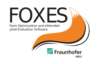

Welcome to FOXES
================

*Farm Optimization and eXtended yield Evaluation Software*

*FOXES* is a modular wind farm and wake modelling code written in Python 
by Fraunhofer IWES. It can be used for wind farm planning, post-construction
analysis and wind farm optimization.

**Quick Start**::

    pip install foxes

Source code repository (and issue tracker):
    https://github.com/FraunhoferIWES/foxes

Contact (please report code issues under the github link above):
    :email:`Jonas Schmidt <jonas.schmidt@iwes.fraunhofer.de>`
    
License:
    MIT_

.. _MIT: https://github.com/FraunhoferIWES/foxes/blob/main/LICENSE

Contents:
    .. toctree::
        :maxdepth: 2
    
        installation

    .. toctree::
        :maxdepth: 2

        notebooks/examples
        
    .. toctree::
        :maxdepth: 1

        api

    .. toctree::
        :maxdepth: 2

        history
