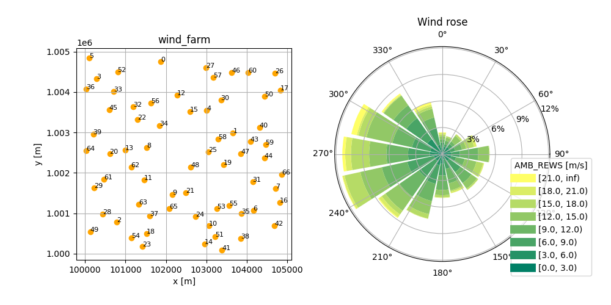

# Input parameter files

Instead of running *foxes* via a Python script, it can also be run from input parameter 
files in [YAML](https://de.wikipedia.org/wiki/YAML) format. For this purpose the two
command line applications `foxes_yaml` and `foxes_windio` have been added.

## foxes\_yaml

### Command and options

The command line tool `foxes_yaml` accepts input yaml files that follow a *foxes* specific
structure, that will be described shortly. A file with the name `inputs.yaml` can then be run in a terminal by

```console
foxes_yaml inputs.yaml
```

If the parameter file is located at a different location, the working directory will be set
to the parent directory of the file. For example

```console
foxes_yaml path/to/inputs.yaml
```

will have the working directory `path/to/`, i.e., all _relative_ file paths for reading and writing will be interpreted relative to that directory. However, _absolute_ file paths will not be altered.

The `foxes_yaml` command has multiple options, which can be checked by

```console
foxes_yaml -h
```

For example, it is possible to everrule the `rotor_model` choice of the `inputs.yaml` file by the model choice `grid25`, by

```console
foxes_yaml inputs.yaml -r grid25
```

Also engine choices can be overruled, for example by

```console
foxes_yaml inputs.yaml -e process -n 8
```

for enforcing a parallel run on 8 processors using the `ProcessEngine`.

If you wish to modify the default output directory, you can do so by

```console
foxes_yaml inputs.yaml -o results
```

which will then write all results files to a directory called `results`, relative to the working directory.

### Input file structure

The structure of *foxes* yaml files is very close to the *foxes* code base. Let's look at an example, available [here](https://github.com/FraunhoferIWES/foxes/blob/main/examples/yaml_input/inputs.yaml) in the *foxes* repository:

```yaml
states:
  states_type: Timeseries               # class from foxes.input.states
  data_source: timeseries_8000.csv.gz   # specify constructor arguments here
  output_vars: [WS, WD, TI, RHO]
  var2col:
    WS: ws
    WD: wd 
    TI: ti
  fixed_vars:
    RHO: 1.225
  
model_book:                 # this section is optional
  turbine_types:            # name of the model book section to be updated
    - name: my_turbine      # name of the new model
      ttype_type: PCtFile   # class from foxes.models.turbine_types
      data_source: NREL-5MW-D126-H90.csv # specify constructor arguments here
  
wind_farm:
  layouts:    # list functions from foxes.input.farm_layout below
    - function: add_from_file
      file_path: test_farm_67.csv
      turbine_models: [my_turbine]

algorithm:
  algo_type: Downwind
  wake_models: [Bastankhah2014_linear_k004]

calc_farm:    # this section is optional; will run by default
  run: True   # this triggers algo.calc_farm

outputs:                          # this section is optional
  - output_type: FarmResultsEval  # class from foxes.output
    functions:                    # list of functions from that class below
      - function: add_capacity
      - function: add_efficiency
  - output_type: StateTurbineMap  # class from foxes.output
    functions:                    # list of functions from that class below
      - function: plot_map        # name of the function
        variable: "EFF"           # specify function parameters here
        cmap: "inferno"
        figsize: [6, 7]
  - output_type: plt              # class from foxes.output
    functions:                    # list of functions from that class below
      - function: show            # runs plt.show(), triggering the display
      - function: close           # runs plt.close(), optional
```

Any of the applicable *foxes* classes and functions can be added to the respective section of the input yaml file, together with the specific parameter choices.

Whenever the outputs provided by the `foxes.output` package are sufficient for what you are planning to do, e.g. simple results writing to csv or NetCDF files, `foxes_yaml` might be the easiest way of running *foxes* for you.

### Plot creation and variables

For the purpose of more complex outputs, it is possible to store results of functions under _variables_, whose names are required to start with the `$` symbol. 

Here is an [example](https://github.com/FraunhoferIWES/foxes/blob/main/examples/yaml_input/inputs2.yaml) modification of the above input file which makes use of variables for the generation of a plot that is combined out of two sub-plots:

```yaml
outputs:
  - output_type: plt
    functions:
      - function: figure
        figsize: [10, 5]
        result_labels: $fig   # store the result of the function under $fig
  - object: $fig              # now run functions of the object behind $fig  
    functions:
      - function: add_subplot
        args: [1, 2, 1]
        result_labels: $ax1   # store the pyplot.Axes object under $ax1
      - function: add_subplot
        args: [1, 2, 2]
        polar: True           # this Axes object applies polar projection
        result_labels: $ax2   # store the pyplot.Axes object under $ax2
  - output_type: FarmLayoutOutput
    functions:
      - function: get_figure
        fig: $fig             # pass the stored Figure object to the function
        ax: $ax1              # pass the stored Axes object to the function
  - output_type: RosePlotOutput
    functions:
      - function: get_figure
        turbine: 0
        ws_var: AMB_REWS
        ws_bins: [0, 3, 6, 9, 12, 15, 18, 21]
        add_inf: True
        wd_sectors: 16
        title: Wind rose
        fig: $fig             # pass the stored Figure object to the function
        ax: $ax2              # pass the stored Axes object to the function
  - output_type: plt
    functions:
      - function: savefig     # save the created figure to file
        fname: result.png     # file location will be relative to the yaml file
      - function: show
      - function: close
```
If a function returns more than one result, those can be associated with variables by providing corresponding lists of variable names, e.g. `result_labels: [$a, $b]` for a function that returns two objects.

For objects that are array-like, it is additionally possible to use a syntax like `$data[0]` or `$data[0, 2, 5]`, etc, for passing sub elements of stored results to function arguments.

Notice the line `object $fig` which starts a section that calls functions of the object behind the `$fig` variable, instead of an instance of an `output_type`. 

The above outputs create and save a figure that is composed of two sub plots, where the second is based on polar projection:




## foxes\_windio

The [windio](https://github.com/IEAWindTask37/windIO) framework is an attempt to unify input and output data of software tools in the wind energy community. This framework is also based on yaml files following a specific schema, which is still under development. Currently *foxes* is following a [windIO fork](https://github.com/EUFLOW/windIO), which can be installed by

```console
pip install git+https://github.com/EUFLOW/windIO@master#egg=windIO
```

_windio_ input can be interpreted and run by foxes via the `foxes_windio` command line tool:

```console
foxes_windio path/to/windio_input.yaml
```

The command line options are very similar to `foxes_yaml`, see above, and

```console
foxes_windio -h
```
